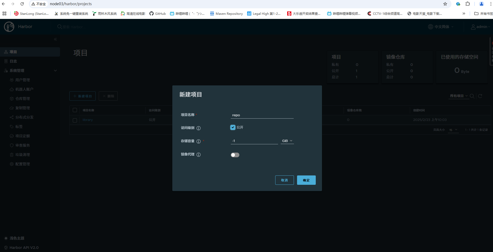
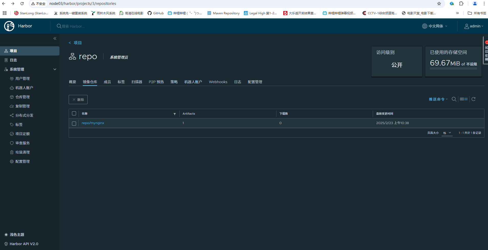

# 制作自定义镜像

## 一、准备镜像

```shell
# 下载镜像
[root@node04 ~]# docker pull nginx:1.26

# 根据镜像启动一个容器
[root@node04 ~]# docker run -d --name mynginx -p 88:80 nginx:1.26

# 修改容器首页
[root@node04 ~]# docker exec -it mynginx /bin/bash
root@f585d2be5d0c:/# cd /usr/share/nginx/html/
root@f585d2be5d0c:/usr/share/nginx/html# echo "<h1>Hello Docker</h1>" > index.html 
```

## 二、保存镜像

- 提交  `docker commit`

  ```shell
  [root@node04 ~]# docker commit --help
  
  Usage:  docker commit [OPTIONS] CONTAINER [REPOSITORY[:TAG]]
  
  Create a new image from a container's changes
  
  Aliases:
    docker container commit, docker commit
  
  Options:
    -a, --author string    Author (e.g., "John Hannibal Smith <hannibal@a-team.com>")
    -c, --change list      Apply Dockerfile instruction to the created image
    -m, --message string   Commit message
    -p, --pause            Pause container during commit (default true)
  ------------------------------------------------------------------------------------------------------
  
  [root@node04 ~]# docker commit -m "update index.html" mynginx mynginx:v1.0
  sha256:1dac497162908b06825fa6552dabfc2bcaa2f1d23a428a665f9e433595a2fd37
  [root@node04 ~]# docker images
  REPOSITORY         TAG       IMAGE ID       CREATED         SIZE
  mynginx            v1.0      1dac49716290   2 seconds ago   192MB
  nginx              1.26      fe94eb5f0c9c   2 weeks ago     192MB
  ```

- 保存 `docker save`

  ```shell
  [root@node04 ~]# docker save --help
  
  Usage:  docker save [OPTIONS] IMAGE [IMAGE...]
  
  Save one or more images to a tar archive (streamed to STDOUT by default)
  
  Aliases:
    docker image save, docker save
  
  Options:
    -o, --output string   Write to a file, instead of STDOUT
  ------------------------------------------------------------------------------------------------------
  
  [root@node04 ~]# docker save -o mynginx.tar mynginx:v1.0
  [root@node04 ~]# ls *.tar
  mynginx.tar
  ```

- 加载 `docker load`

  ```shell
  [root@node04 ~]# docker load --help
  
  Usage:  docker load [OPTIONS]
  
  Load an image from a tar archive or STDIN
  
  Aliases:
    docker image load, docker load
  
  Options:
    -i, --input string   Read from tar archive file, instead of STDIN
    -q, --quiet          Suppress the load output
  
  ------------------------------------------------------------------------------------------------------
  
  # 把原先的镜像删除再导入保存的镜像
  [root@node04 ~]# docker rm -f mynginx
  [root@node04 ~]# docker rmi mynginx:v1.0
  
  [root@node04 ~]# docker load -i mynginx.tar 
  7914c8f600f5: Loading layer [==================================================>]  77.83MB/77.83MB
  263be8d15880: Loading layer [==================================================>]  118.2MB/118.2MB
  043f2436492e: Loading layer [==================================================>]  3.584kB/3.584kB
  867f455c499d: Loading layer [==================================================>]  4.608kB/4.608kB
  a676f50129b7: Loading layer [==================================================>]   2.56kB/2.56kB
  8190a7b44dae: Loading layer [==================================================>]   5.12kB/5.12kB
  d9c572c95560: Loading layer [==================================================>]  7.168kB/7.168kB
  0d434b497f97: Loading layer [==================================================>]  17.41kB/17.41kB
  Loaded image: mynginx:v1.0
  
  # 镜像导入成功后，再启动一个容器观察首页效果
  ```


## 三、把镜像推送到社区

### 1、harbor 安装

采用离线安装： harbor-offline-installer-v2.3.4.tgz

```shell
# 解压 
tar -zxf harbor-offline-installer-v2.3.4.tgz -C /usr/local/

# 查看文件
[root@node03 harbor]# cd /usr/local/harbor
[root@node03 harbor]# ll
total 596292
-rw-r--r-- 1 root root      3361 Nov  9  2021 common.sh
-rw-r--r-- 1 root root 610560420 Nov  9  2021 harbor.v2.3.4.tar.gz
-rw-r--r-- 1 root root      7844 Oct 16 21:57 harbor.yml
-rw-r--r-- 1 root root      7840 Oct 16 21:55 harbor.yml.bak
-rwxr-xr-x 1 root root      2500 Nov  9  2021 install.sh
-rw-r--r-- 1 root root     11347 Nov  9  2021 LICENSE
-rwxr-xr-x 1 root root      1881 Nov  9  2021 prepare

# 修改  harbor.yml
hostname: 192.168.235.13              # 指定主机IP
port: 80                              # 指定主机端口
# https related config                # https有关的都注释起来
harbor_admin_password: Harbor12345    # harbor 默认admin密码

# 运行 
[root@node03 harbor]# ./install.sh  # 需要提前准备好 docker-compose(1.18.0+) 
```

启动并新建镜像仓库



### 2、给自定义镜像打标签

```shell
# 自定义镜像命名格式
# harbor地址/项目名/镜像名:版本

# 修改 /etc/docker/daemon.json
{
  "exec-opts": ["native.cgroupdriver=systemd"],
  "registry-mirrors": [
        "https://fas7p1ea.mirror.aliyuncs.com",
        "https://dockerpull.com",
        "https://docker.1panel.live",
        "https://dockerproxy.cn",
        "https://docker.hpcloud.cloud",
        "https://docker.1ms.run",
        "https://hub.rat.dev",
        "https://docker.1panel.live"
  ],
  "insecure-registries": ["192.168.235.13:80"] # 新增这一行，指定私有仓库地址, 修改完之后重启docker
}

# 通过docker commit 生成的自定义镜像
[root@node03 docker]# docker images
REPOSITORY                                                       TAG               IMAGE ID       CREATED          SIZE
mynginx                                                          v1.0              10757adca3cb   10 s

# 给自定义镜像打标签
[root@node03 docker]# docker tag  10757adca3cb 192.168.235.13:80/repo/mynginx:v1.0

[root@node03 docker]# docker images
REPOSITORY                                                       TAG               IMAGE ID       CREATED              SIZE
192.168.235.13:80/repo/mynginx                                   v1.0              10757adca3cb   About a minute ago   192MB
mynginx                                                          v1.0              10757adca3cb   About a minute ago   192MB

# 推送镜像
# 推送前先登录
[root@node03 docker]# docker login -u admin -p Harbor12345 192.168.235.13:80
WARNING! Using --password via the CLI is insecure. Use --password-stdin.
WARNING! Your password will be stored unencrypted in /root/.docker/config.json.
Configure a credential helper to remove this warning. See
https://docs.docker.com/engine/reference/commandline/login/#credentials-store

Login Succeeded

# 开始推送
[root@node03 docker]# docker push 192.168.235.13:80/repo/mynginx:v1.0
The push refers to repository [192.168.235.13:80/repo/mynginx]
02cec94e3699: Pushed 
d9c572c95560: Pushed 
8190a7b44dae: Pushed 
a676f50129b7: Pushed 
867f455c499d: Pushed 
043f2436492e: Pushed 
263be8d15880: Pushed 
7914c8f600f5: Pushed 
v1.0: digest: sha256:be292d38e696ca33a3aeaaf36df969b88d6a0b82613d3393f1c63f933ddcdaea size: 1986
```

查看推送结果



