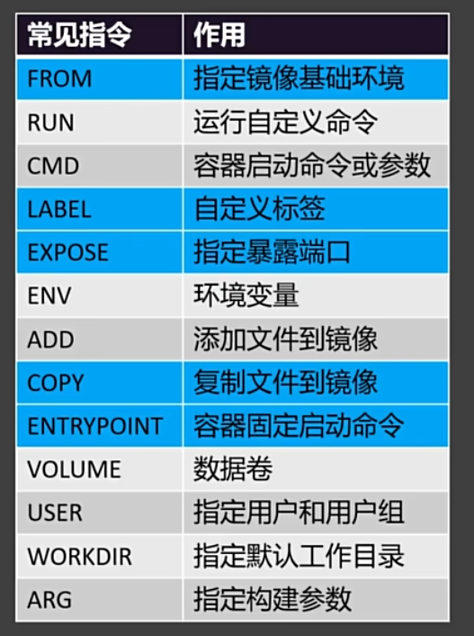

# dockerfile

dockerfile 把自己的软件制作成镜像

文档地址：https://docs.docker.com/reference/dockerfile/



## 一、自己写一个软件

```xml
<?xml version="1.0" encoding="UTF-8"?>
<project xmlns="http://maven.apache.org/POM/4.0.0"
         xmlns:xsi="http://www.w3.org/2001/XMLSchema-instance"
         xsi:schemaLocation="http://maven.apache.org/POM/4.0.0 http://maven.apache.org/xsd/maven-4.0.0.xsd">
    <modelVersion>4.0.0</modelVersion>

    <groupId>com.stanlong</groupId>
    <artifactId>Test</artifactId>
    <version>1.0-SNAPSHOT</version>

    <parent>
        <groupId>org.springframework.boot</groupId>
        <artifactId>spring-boot-starter-parent</artifactId>
        <version>2.3.6.RELEASE</version>
    </parent>

    <!-- web启动器 -->
    <dependencies>
        <dependency>
            <groupId>org.springframework.boot</groupId>
            <artifactId>spring-boot-starter-web</artifactId>
        </dependency>
    </dependencies>

    <build>
        <finalName>mytest</finalName>
        <plugins>
            <plugin>
                <groupId>org.springframework.boot</groupId>
                <artifactId>spring-boot-maven-plugin</artifactId>
            </plugin>
        </plugins>
    </build>

</project>
```

```java
package com.stanlong.com.stanlong.controller;

import org.springframework.web.bind.annotation.GetMapping;
import org.springframework.web.bind.annotation.RestController;

@RestController
public class HelloController {

    @GetMapping("/")
    public String hello(){
        return "Hello Docker";
    }

}
```

```java
package com.stanlong;

import org.springframework.boot.SpringApplication;
import org.springframework.boot.autoconfigure.SpringBootApplication;

@SpringBootApplication
public class MainApplication {
    public static void main(String[] args) {
        SpringApplication.run(MainApplication.class, args);
    }
}
```

将软件打成jar包


## 二、把 mytest.jar 制作成镜像

把mytest.jar上传到服务器上，编写 Dockerfile 文件

```dockerfile
[root@node03 ~]# cat Dockerfile 
FROM openjdk:8-jdk-alpine  # 指定基础运行环境， 基础镜像地址： https://hub-stage.docker.com/

LABEL author=StanLong # 打个标签

COPY mytest.jar /mytest.jar # 把自己的软件放到容器的根目录下，也叫mytest.jar

EXPOSE 8080 # 对外暴露端口8080

ENTRYPOINT ["java", "-jar", "/mytest.jar"] # ENTRYPOINT用于定义主命令
```

执行命令

```shell
[root@node03 ~]# docker build -f Dockerfile -t mytest:v1.0 .  # 注意最后有个点, 表示在当前路径下执行 Dockerfile
```

查看自己制作的镜像

```shell
[root@node03 ~]# docker images
REPOSITORY                                                       TAG               IMAGE ID       CREATED          SIZE
mytest                                                           v1.0              697b89d898ca   11 seconds ago   121MB  # 自己制作的镜像
```

运行访问

```shell
[root@node03 ~]# docker run -d --name mytest -p 8888:8080 mytest:v1.0
89883325d72a55e8c6100bb54a4e9a6bcdb24f6edebd339f7e25afeb205891d6
```

访问 node03:8888 观察效果


