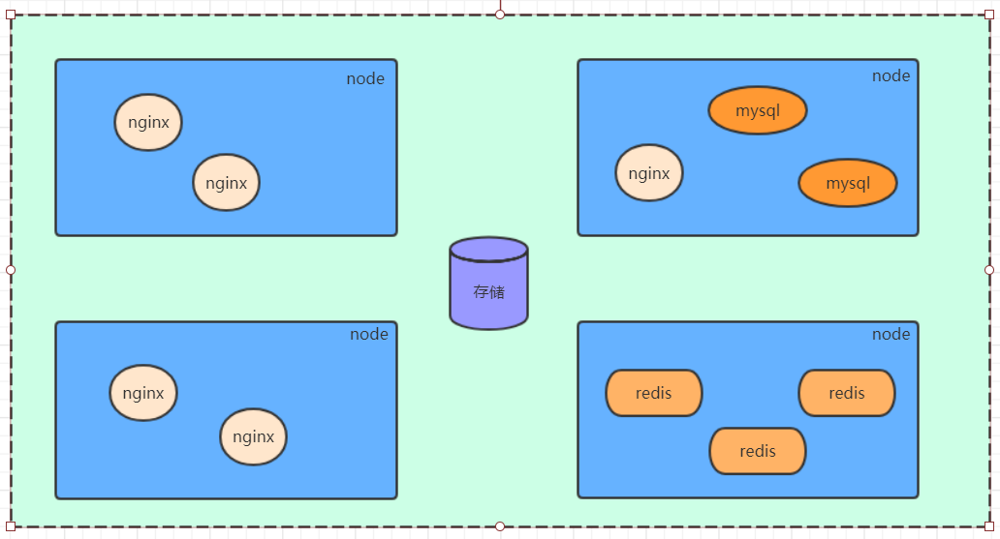
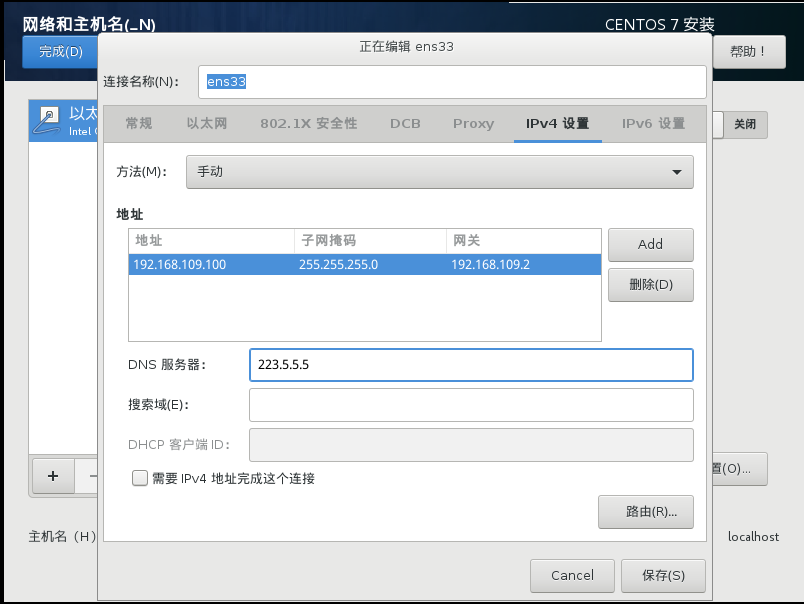
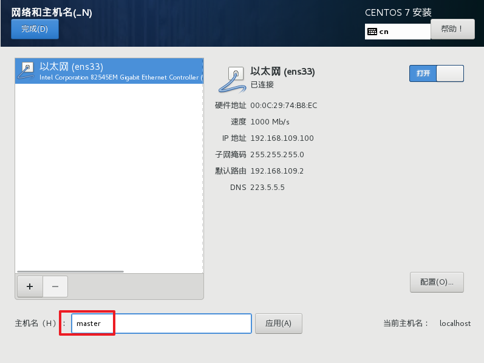

# 第一章 kubernetes介绍

本章节主要介绍应用程序在服务器上部署方式演变以及kubernetes的概念、组件和工作原理。

## 应用部署方式演变

在部署应用程序的方式上，主要经历了三个时代：

- **传统部署**：互联网早期，会直接将应用程序部署在物理机上

  > 优点：简单，不需要其它技术的参与
  >
  > 缺点：不能为应用程序定义资源使用边界，很难合理地分配计算资源，而且程序之间容易产生影响
  
- **虚拟化部署**：可以在一台物理机上运行多个虚拟机，每个虚拟机都是独立的一个环境

  > 优点：程序环境不会相互产生影响，提供了一定程度的安全性
  >
  > 缺点：增加了操作系统，浪费了部分资源

- **容器化部署**：与虚拟化类似，但是共享了操作系统

  > 优点：
  >
  > ​    可以保证每个容器拥有自己的文件系统、CPU、内存、进程空间等
  >
  > ​    运行应用程序所需要的资源都被容器包装，并和底层基础架构解耦
  >
  > ​    容器化的应用程序可以跨云服务商、跨Linux操作系统发行版进行部署


容器化部署方式给带来很多的便利，但是也会出现一些问题，比如说：

- 一个容器故障停机了，怎么样让另外一个容器立刻启动去替补停机的容器
- 当并发访问量变大的时候，怎么样做到横向扩展容器数量

这些容器管理的问题统称为**容器编排**问题，为了解决这些容器编排问题，就产生了一些容器编排的软件：

- **Swarm**：Docker自己的容器编排工具
- **Mesos**：Apache的一个资源统一管控的工具，需要和Marathon结合使用
- **Kubernetes**：Google开源的的容器编排工具


## kubernetes简介


​    

​    kubernetes，是一个全新的基于容器技术的分布式架构领先方案，是谷歌严格保密十几年的秘密武器----Borg系统的一个开源版本，于2014年9月发布第一个版本，2015年7月发布第一个正式版本。

​    kubernetes的本质是**一组服务器集群**，它可以在集群的每个节点上运行特定的程序，来对节点中的容器进行管理。目的是实现资源管理的自动化，主要提供了如下的主要功能：

- **自我修复**：一旦某一个容器崩溃，能够在1秒中左右迅速启动新的容器
- **弹性伸缩**：可以根据需要，自动对集群中正在运行的容器数量进行调整
- **服务发现**：服务可以通过自动发现的形式找到它所依赖的服务
- **负载均衡**：如果一个服务起动了多个容器，能够自动实现请求的负载均衡
- **版本回退**：如果发现新发布的程序版本有问题，可以立即回退到原来的版本
- **存储编排**：可以根据容器自身的需求自动创建存储卷



## kubernetes组件

一个kubernetes集群主要是由**控制节点(master)**、**工作节点(node)**构成，每个节点上都会安装不同的组件。

**master：集群的控制平面，负责集群的决策  (  管理  )**

> **ApiServer** : 资源操作的唯一入口，接收用户输入的命令，提供认证、授权、API注册和发现等机制
>
> **Scheduler** : 负责集群资源调度，按照预定的调度策略将Pod调度到相应的node节点上
>
> **ControllerManager** : 负责维护集群的状态，比如程序部署安排、故障检测、自动扩展、滚动更新等
>
> **Etcd**：负责存储集群中各种资源对象的信息

**node：集群的数据平面，负责为容器提供运行环境 ( 干活 )** 

> **Kubelet** : 负责维护容器的生命周期，即通过控制docker，来创建、更新、销毁容器
>
> **KubeProxy** : 负责提供集群内部的服务发现和负载均衡
>
> **Docker** : 负责节点上容器的各种操作


下面，以部署一个nginx服务来说明kubernetes系统各个组件调用关系：

1. 首先要明确，一旦kubernetes环境启动之后，master和node都会将自身的信息存储到etcd数据库中

2. 一个nginx服务的安装请求会首先被发送到master节点的apiServer组件

3. apiServer组件会调用scheduler组件来决定到底应该把这个服务安装到哪个node节点上

   在此时，它会从etcd中读取各个node节点的信息，然后按照一定的算法进行选择，并将结果告知apiServer

4. apiServer调用controller-manager去调度Node节点安装nginx服务

5. kubelet接收到指令后，会通知docker，然后由docker来启动一个nginx的pod

   pod是kubernetes的最小操作单元，容器必须跑在pod中至此，

6. 一个nginx服务就运行了，如果需要访问nginx，就需要通过kube-proxy来对pod产生访问的代理。

​        这样，外界用户就可以访问集群中的nginx服务了

## kubernetes概念

**Master**：集群控制节点，每个集群需要至少一个master节点负责集群的管控

**Node**：工作负载节点，由master分配容器到这些node工作节点上，然后node节点上的docker负责容器的运行

**Pod**：kubernetes的最小控制单元，容器都是运行在pod中的，一个pod中可以有1个或者多个容器

**Controller**：控制器，通过它来实现对pod的管理，比如启动pod、停止pod、伸缩pod的数量等等

**Service**：pod对外服务的统一入口，下面可以维护者同一类的多个pod

**Label**：标签，用于对pod进行分类，同一类pod会拥有相同的标签

**NameSpace**：命名空间，用来隔离pod的运行环境


# 第二章 集群环境搭建

本章节主要介绍如何搭建kubernetes的集群环境

## 环境规划

### 集群类型

kubernetes集群大体上分为两类：**一主多从**和**多主多从**。

- 一主多从：一台Master节点和多台Node节点，搭建简单，但是有单机故障风险，适合用于测试环境
- 多主多从：多台Master节点和多台Node节点，搭建麻烦，安全性高，适合用于生产环境


> `说明：为了测试简单，本次搭建的是  一主两从   类型的集群`

### 安装方式

kubernetes有多种部署方式，目前主流的方式有kubeadm、minikube、二进制包

- minikube：一个用于快速搭建单节点kubernetes的工具
- kubeadm：一个用于快速搭建kubernetes集群的工具
- 二进制包 ：从官网下载每个组件的二进制包，依次去安装，此方式对于理解kubernetes组件更加有效

> `说明：现在需要安装kubernetes的集群环境，但是又不想过于麻烦，所以选择使用kubeadm方式`

### 主机规划

| 作用   | IP地址          | 操作系统                    | 配置                     |
| ------ | --------------- | --------------------------- | ------------------------ |
| Master | 192.168.109.101 | Centos7.9    基础设施服务器 | 2颗CPU  2G内存   50G硬盘 |
| Node1  | 192.168.109.102 | Centos7.9    基础设施服务器 | 2颗CPU  2G内存   50G硬盘 |
| Node2  | 192.168.109.103 | Centos7.9    基础设施服务器 | 2颗CPU  2G内存   50G硬盘 |

## 环境搭建

​    本次环境搭建需要安装三台Centos服务器（一主二从），然后在每台服务器中分别安装docker（18.06.3），kubeadm（1.17.4）、kubelet（1.17.4）、kubectl（1.17.4）程序。

### 主机安装

安装虚拟机过程中注意下面选项的设置：

- 操作系统环境：CPU（2C）    内存（2G）   硬盘（50G）    

- 语言选择：中文简体

- 软件选择：基础设施服务器

- 分区选择：自动分区

- 网络配置：按照下面配置网路地址信息

  ~~~md
  网络地址：192.168.109.100  （每台主机都不一样  分别为100、101、102）
  子网掩码：255.255.255.0
  默认网关：192.168.109.2
  DNS：    223.5.5.5
  ~~~

  

- 主机名设置：按照下面信息设置主机名

  ~~~md
  master节点： master
  node节点：   node1
  node节点：   node2
  ~~~

  

### 环境初始化

1)    检查操作系统的版本

~~~powershell
# 此方式下安装kubernetes集群要求Centos版本要在7.5或之上
[root@master ~]# cat /etc/redhat-release
CentOS Linux release 7.5.1804 (Core)
~~~

2） 主机名解析

为了方便后面集群节点间的直接调用，在这配置一下主机名解析，企业中推荐使用内部DNS服务器

```powershell
# 主机名成解析 编辑三台服务器的/etc/hosts文件，添加下面内容
192.168.109.100  master
192.168.109.101  node1
192.168.109.102  node2
```
3） 时间同步

kubernetes要求集群中的节点时间必须精确一致，这里直接使用chronyd服务从网络同步时间。

企业中建议配置内部的时间同步服务器

~~~powershell
# 启动chronyd服务
[root@master ~]# systemctl start chronyd
# 设置chronyd服务开机自启
[root@master ~]# systemctl enable chronyd
# chronyd服务启动稍等几秒钟，就可以使用date命令验证时间了
[root@master ~]# date
~~~

4） 禁用iptables和firewalld服务

kubernetes和docker在运行中会产生大量的iptables规则，为了不让系统规则跟它们混淆，直接关闭系统的规则

~~~powershell
# 1 关闭firewalld服务
[root@master ~]# systemctl stop firewalld
[root@master ~]# systemctl disable firewalld
# 2 关闭iptables服务
[root@master ~]# systemctl stop iptables
[root@master ~]# systemctl disable iptables
~~~

5） 禁用selinux

 selinux是linux系统下的一个安全服务，如果不关闭它，在安装集群中会产生各种各样的奇葩问题

~~~powershell
# 编辑 /etc/selinux/config 文件，修改SELINUX的值为disabled
# 注意修改完毕之后需要重启linux服务
SELINUX=disabled
~~~

6） 禁用swap分区

swap分区指的是虚拟内存分区，它的作用是在物理内存使用完之后，将磁盘空间虚拟成内存来使用

启用swap设备会对系统的性能产生非常负面的影响，因此kubernetes要求每个节点都要禁用swap设备

但是如果因为某些原因确实不能关闭swap分区，就需要在集群安装过程中通过明确的参数进行配置说明

~~~powershell
# 编辑分区配置文件/etc/fstab，注释掉swap分区一行
# 注意修改完毕之后需要重启linux服务
 UUID=455cc753-7a60-4c17-a424-7741728c44a1 /boot    xfs     defaults        0 0
 /dev/mapper/centos-home /home                      xfs     defaults        0 0
# /dev/mapper/centos-swap swap                      swap    defaults        0 0
~~~

或者直接执行 `sed -i "s/^[^#].*swap*/# &/" /etc/fstab`

7）修改linux的内核参数

~~~powershell
# 修改linux的内核参数，添加网桥过滤和地址转发功能
# 编辑/etc/sysctl.d/kubernetes.conf文件，添加如下配置:
cat > /etc/sysctl.d/kubernetes.conf << EOF
net.bridge.bridge-nf-call-ip6tables = 1
net.bridge.bridge-nf-call-iptables = 1
net.ipv4.ip_forward = 1
EOF

# 重新加载配置
[root@master ~]# sysctl -p

# 加载网桥过滤模块
[root@master ~]# modprobe br_netfilter

# 查看网桥过滤模块是否加载成功
[root@master ~]# lsmod | grep br_netfilter
~~~

8）配置ipvs功能

在kubernetes中service有两种代理模型，一种是基于iptables的，一种是基于ipvs的

两者比较的话，ipvs的性能明显要高一些，但是如果要使用它，需要手动载入ipvs模块

~~~powershell
# 1 安装ipset和 ipvsadm
[root@master ~]# yum install ipset ipvsadm -y

# 2 添加需要加载的模块写入脚本文件
[root@master ~]# cat <<EOF >  /etc/sysconfig/modules/ipvs.modules
#!/bin/bash
modprobe -- ip_vs
modprobe -- ip_vs_rr
modprobe -- ip_vs_wrr
modprobe -- ip_vs_sh
modprobe -- nf_conntrack_ipv4
EOF

# 3 为脚本文件添加执行权限
[root@master ~]# chmod +x /etc/sysconfig/modules/ipvs.modules

# 4 执行脚本文件
[root@master ~]# /bin/bash /etc/sysconfig/modules/ipvs.modules

# 5 查看对应的模块是否加载成功
[root@master ~]# lsmod | grep -e ip_vs -e nf_conntrack_ipv4
~~~

9） 重启服务器

上面步骤完成之后，需要重新启动linux系统

~~~powershell
[root@master ~]# reboot
~~~

### 安装docker

~~~powershell
# 1 切换镜像源
[root@master ~]# wget https://mirrors.aliyun.com/docker-ce/linux/centos/docker-ce.repo -O /etc/yum.repos.d/docker-ce.repo

# 2 查看当前镜像源中支持的docker版本
[root@master ~]# yum list docker-ce --showduplicates

# 3 安装特定版本的docker-ce
# 必须指定--setopt=obsoletes=0，否则yum会自动安装更高版本
[root@master ~]# yum install --setopt=obsoletes=0 docker-ce-18.06.3.ce-3.el7 -y

# 4 配置docker阿里云加速器，https://cr.console.aliyun.com/cn-hangzhou/instances/mirrors
# Docker在默认情况下使用的Cgroup Driver为cgroupfs，而kubernetes推荐使用systemd来代替cgroupfs
# 如果两边不一样启动kubelet会报错： kubelet cgroup driver: "systemd" is different from docker cgroup driver: "cgroupfs"
# [root@master ~]# mkdir /etc/docker
# [root@master ~]# cat <<EOF >  /etc/docker/daemon.json
# {
#   "exec-opts": ["native.cgroupdriver=systemd"],
#  "registry-mirrors": ["https://fas7p1ea.mirror.aliyuncs.com"]
# }
# EOF

# 4 配置docker阿里云加速器， 2024年6月dockerhub被墙了，加速器用下面这个
# 参考 https://www.bilibili.com/video/BV1w4421X7jE/?spm_id_from=333.337.search-card.all.click&vd_source=165a812497dd3d7dfba718ae4ef14867
cat > /etc/docker/daemon.json << EOF
{
  "exec-opts": ["native.cgroupdriver=systemd"],
  "registry-mirrors": [
     "https://dockerpull.com"
  ]
}
EOF


# 5 启动docker
[root@master ~]# systemctl restart docker
[root@master ~]# systemctl enable docker

# 6 检查docker状态和版本
[root@master ~]# docker version
~~~

### 安装kubernetes组件

~~~powershell
# 由于kubernetes的镜像源在国外，速度比较慢，这里切换成国内的镜像源
# 编辑/etc/yum.repos.d/kubernetes.repo，添加下面的配置 
cat > /etc/yum.repos.d/kubernetes.repo << EOF
[kubernetes]
name=Kubernetes
baseurl=http://mirrors.aliyun.com/kubernetes/yum/repos/kubernetes-el7-x86_64
enabled=1
gpgcheck=0
repo_gpgcheck=0
gpgkey=http://mirrors.aliyun.com/kubernetes/yum/doc/yum-key.gpg
       http://mirrors.aliyun.com/kubernetes/yum/doc/rpm-package-key.gpg
EOF

# 安装kubeadm、kubelet和kubectl
[root@master ~]# yum install --setopt=obsoletes=0 kubeadm-1.17.4-0 kubelet-1.17.4-0 kubectl-1.17.4-0 -y

# 配置kubelet的cgroup
# 编辑/etc/sysconfig/kubelet，添加下面的配置
cat > /etc/sysconfig/kubelet << EOF
KUBELET_CGROUP_ARGS="--cgroup-driver=systemd"
KUBE_PROXY_MODE="ipvs"
EOF

# 4 设置kubelet开机自启
[root@master ~]# systemctl enable kubelet
~~~

### 准备集群镜像

~~~powershell
# 在安装kubernetes集群之前，必须要提前准备好集群需要的镜像，所需镜像可以通过下面命令查看
[root@master ~]# kubeadm config images list

# 下载镜像
# 此镜像在kubernetes的仓库中,由于网络原因,无法连接，下面提供了一种替代方案
images=(
    kube-apiserver:v1.17.4
    kube-controller-manager:v1.17.4
    kube-scheduler:v1.17.4
    kube-proxy:v1.17.4
    pause:3.1
    etcd:3.4.3-0
    coredns:1.6.5
)

for imageName in ${images[@]} ; do
	docker pull registry.cn-hangzhou.aliyuncs.com/google_containers/$imageName
	docker tag registry.cn-hangzhou.aliyuncs.com/google_containers/$imageName 		k8s.gcr.io/$imageName
	docker rmi registry.cn-hangzhou.aliyuncs.com/google_containers/$imageName
done
~~~

### 集群初始化

下面开始对集群进行初始化，并将node节点加入到集群中

> 下面的操作只需要在`master`节点上执行即可
>

~~~powershell
# 创建集群
[root@master ~]# kubeadm init \
	--kubernetes-version=v1.17.4 \
    --pod-network-cidr=10.244.0.0/16 \
    --service-cidr=10.96.0.0/12 \
    --apiserver-advertise-address=192.168.109.100

# 创建必要文件
[root@master ~]# mkdir -p $HOME/.kube
[root@master ~]# sudo cp -i /etc/kubernetes/admin.conf $HOME/.kube/config
[root@master ~]# sudo chown $(id -u):$(id -g) $HOME/.kube/config
~~~

> 下面的操作只需要在`node`节点上执行即可
>

~~~powershell
# 将node节点加入集群
[root@master ~]# kubeadm join 192.168.109.100:6443 \ 
	--token 8507uc.o0knircuri8etnw2 \
	--discovery-token-ca-cert-hash \
	sha256:acc37967fb5b0acf39d7598f8a439cc7dc88f439a3f4d0c9cae88e7901b9d3f
	
# 查看集群状态 此时的集群状态为NotReady，这是因为还没有配置网络插件
[root@master ~]# kubectl get nodes
NAME     STATUS     ROLES    AGE     VERSION
master   NotReady   master   6m43s   v1.17.4
node1    NotReady   <none>   22s     v1.17.4
node2    NotReady   <none>   19s     v1.17.4
~~~

### 安装网络插件

kubernetes支持多种网络插件，比如flannel、calico、canal等等，任选一种使用即可，本次选择flannel

> 下面操作依旧只在`master`节点执行即可，插件使用的是DaemonSet的控制器，它会在每个节点上都运行
>

~~~powershell
# 获取fannel的配置文件, 这个文件要是下载不下来可以直接用资料里准备好的
[root@master ~]# wget https://raw.githubusercontent.com/coreos/flannel/master/Documentation/kube-flannel.yml


# 使用配置文件启动fannel
[root@master ~]# kubectl apply -f kube-flannel.yml

# 稍等片刻，再次查看集群节点的状态
[root@master ~]# kubectl get nodes
NAME     STATUS   ROLES    AGE     VERSION
master   Ready    master   15m     v1.17.4
node1    Ready    <none>   8m53s   v1.17.4
node2    Ready    <none>   8m50s   v1.17.4

# 如果这里没有变成 ready ， 参考文档 https://blog.csdn.net/m0_66908465/article/details/131297723?spm=1001.2014.3001.5501
~~~

至此，kubernetes的集群环境搭建完成

## 服务部署

接下来在kubernetes集群中部署一个nginx程序，测试下集群是否在正常工作。

~~~powershell
# 部署nginx
[root@master ~]# kubectl create deployment nginx --image=nginx:1.14-alpine

# 暴露端口
[root@master ~]# kubectl expose deployment nginx --port=80 --type=NodePort

# 查看服务状态
[root@master ~]# kubectl get pods,service
NAME                         READY   STATUS    RESTARTS   AGE
pod/nginx-86c57db685-fdc2k   1/1     Running   0          18m

NAME                 TYPE        CLUSTER-IP      EXTERNAL-IP   PORT(S)        AGE
service/kubernetes   ClusterIP   10.96.0.1       <none>        443/TCP        82m
service/nginx        NodePort    10.104.121.45   <none>        80:30073/TCP   17m

# 4 最后在电脑上访问下部署的nginx服务
~~~


# 第三章 资源管理

本章节主要介绍yaml语法和kubernetes的资源管理方式

## 资源管理介绍

在kubernetes中，所有的内容都抽象为资源，用户需要通过操作资源来管理kubernetes。

>​    kubernetes的本质上就是一个集群系统，用户可以在集群中部署各种服务，所谓的部署服务，其实就是在kubernetes集群中运行一个个的容器，并将指定的程序跑在容器中。
>
>​    kubernetes的最小管理单元是pod而不是容器，所以只能将容器放在`Pod`中，而kubernetes一般也不会直接管理Pod，而是通过`Pod控制器`来管理Pod的。
>
>​    Pod可以提供服务之后，就要考虑如何访问Pod中服务，kubernetes提供了`Service`资源实现这个功能。
>
>​    当然，如果Pod中程序的数据需要持久化，kubernetes还提供了各种`存储`系统。


>  学习kubernetes的核心，就是学习如何对集群上的`Pod、Pod控制器、Service、存储`等各种资源进行操作

## YAML语言介绍

​    YAML是一个类似 XML、JSON 的标记性语言。它强调以**数据**为中心，并不是以标识语言为重点。因而YAML本身的定义比较简单，号称"一种人性化的数据格式语言"。

~~~xml
<heima>
	<age>15</age>
    <address>Beijing</address>
</heima>
~~~

~~~yaml
heima:
  age: 15
  address: Beijing
~~~

YAML的语法比较简单，主要有下面几个：

- 大小写敏感
- 使用缩进表示层级关系
- 缩进不允许使用tab，只允许空格( 低版本限制 )
- 缩进的空格数不重要，只要相同层级的元素左对齐即可
- '#'表示注释

YAML支持以下几种数据类型：

- 纯量：单个的、不可再分的值
- 对象：键值对的集合，又称为映射（mapping）/ 哈希（hash） / 字典（dictionary）
- 数组：一组按次序排列的值，又称为序列（sequence） / 列表（list）

~~~yaml
# 纯量, 就是指的一个简单的值，字符串、布尔值、整数、浮点数、Null、时间、日期
# 1 布尔类型
c1: true (或者True)
# 2 整型
c2: 234
# 3 浮点型
c3: 3.14
# 4 null类型 
c4: ~  # 使用~表示null
# 5 日期类型
c5: 2018-02-17    # 日期必须使用ISO 8601格式，即yyyy-MM-dd
# 6 时间类型
c6: 2018-02-17T15:02:31+08:00  # 时间使用ISO 8601格式，时间和日期之间使用T连接，最后使用+代表时区
# 7 字符串类型
c7: heima     # 简单写法，直接写值 , 如果字符串中间有特殊字符，必须使用双引号或者单引号包裹 
c8: line1
    line2     # 字符串过多的情况可以拆成多行，每一行会被转化成一个空格
~~~

~~~yaml
# 对象
# 形式一(推荐):
heima:
  age: 15
  address: Beijing
# 形式二(了解):
heima: {age: 15,address: Beijing}
~~~

~~~yaml
# 数组
# 形式一(推荐):
address:
  - 顺义
  - 昌平	
# 形式二(了解):
address: [顺义,昌平]
~~~

> 小提示：
>
> ​	1  书写yaml切记`:` 后面要加一个空格
>
> ​	2  如果需要将多段yaml配置放在一个文件中，中间要使用`---`分隔
>
> ​    3 下面是一个yaml转json的网站，可以通过它验证yaml是否书写正确
>
> ​       https://www.json2yaml.com/convert-yaml-to-json

## 资源管理方式

- 命令式对象管理：直接使用命令去操作kubernetes资源

  `kubectl run nginx-pod --image=nginx:1.17.1 --port=80`

- 命令式对象配置：通过命令配置和配置文件去操作kubernetes资源

  `kubectl create/patch -f nginx-pod.yaml`

- 声明式对象配置：通过apply命令和配置文件去操作kubernetes资源

  `kubectl apply -f nginx-pod.yaml`

| 类型           | 操作对象 | 适用环境 | 优点           | 缺点                             |
| -------------- | -------- | -------- | -------------- | -------------------------------- |
| 命令式对象管理 | 对象     | 测试     | 简单           | 只能操作活动对象，无法审计、跟踪 |
| 命令式对象配置 | 文件     | 开发     | 可以审计、跟踪 | 项目大时，配置文件多，操作麻烦   |
| 声明式对象配置 | 目录     | 开发     | 支持目录操作   | 意外情况下难以调试               |

### 命令式对象管理

**kubectl命令**

​    kubectl是kubernetes集群的命令行工具，通过它能够对集群本身进行管理，并能够在集群上进行容器化应用的安装部署。kubectl命令的语法如下：

~~~md
kubectl [command] [type] [name] [flags]
~~~

**comand**：指定要对资源执行的操作，例如create、get、delete

**type**：指定资源类型，比如deployment、pod、service

**name**：指定资源的名称，名称大小写敏感

**flags**：指定额外的可选参数

~~~powershell
# 查看所有pod
kubectl get pod 

# 查看某个pod
kubectl get pod pod_name

# 查看某个pod,以yaml格式展示结果
kubectl get pod pod_name -o yaml
~~~

**资源类型**

kubernetes中所有的内容都抽象为资源，可以通过下面的命令进行查看:

~~~powershell
kubectl api-resources
~~~

经常使用的资源有下面这些：

<table>
	<tr>
	    <th>资源分类</th>
	    <th>资源名称</th>
		<th>缩写</th>
		<th>资源作用</th>
	</tr>
	<tr>
	    <td rowspan="2">集群级别资源</td>
        <td>nodes</td>
	    <td>no</td>
		<td>集群组成部分</td>
	</tr>
	<tr>
		<td>namespaces</td>
	    <td>ns</td>
		<td>隔离Pod</td>
	</tr>
	<tr>
		<td>pod资源</td>
	    <td>pods</td>
	    <td>po</td>
		<td>装载容器</td>
	</tr>
	<tr>
		<td rowspan="8">pod资源控制器</td>
	    <td>replicationcontrollers</td>
	    <td>rc</td>
		<td>控制pod资源</td>
	</tr>
	<tr>
	    <td>replicasets</td>
	    <td>rs</td>
		<td>控制pod资源</td>
	</tr>
	<tr>
	    <td>deployments</td>
	    <td>deploy</td>
		<td>控制pod资源</td>
	</tr>
	<tr>
	    <td>daemonsets</td>
	    <td>ds</td>
		<td>控制pod资源</td>
	</tr>
	<tr>
	    <td>jobs</td>
	    <td></td>
		<td>控制pod资源</td>
	</tr>	
	<tr>
	    <td>cronjobs</td>
	    <td>cj</td>
		<td>控制pod资源</td>
	</tr>	
	<tr>
	    <td>horizontalpodautoscalers</td>
	    <td>hpa</td>
		<td>控制pod资源</td>
	</tr>	
	<tr>
	    <td>statefulsets</td>
	    <td>sts</td>
		<td>控制pod资源</td>
	</tr>
	<tr>
		<td rowspan="2">服务发现资源</td>
	    <td>services</td>
	    <td>svc</td>
		<td>统一pod对外接口</td>
	</tr>
    <tr>
	    <td>ingress</td>
	    <td>ing</td>
		<td>统一pod对外接口</td>
	</tr>
	<tr>
		<td rowspan="3">存储资源</td>
	    <td>volumeattachments</td>
	    <td></td>
		<td>存储</td>
	</tr>
	<tr>
	    <td>persistentvolumes</td>
	    <td>pv</td>
		<td>存储</td>
	</tr>
	<tr>
	    <td>persistentvolumeclaims</td>
	    <td>pvc</td>
		<td>存储</td>
	</tr>
	<tr>
		<td rowspan="2">配置资源</td>
	    <td>configmaps</td>
	    <td>cm</td>
		<td>配置</td>
	</tr>
	<tr>
	    <td>secrets</td>
	    <td></td>
		<td>配置</td>
	</tr>
</table>
**操作**

kubernetes允许对资源进行多种操作，可以通过--help查看详细的操作命令

~~~powershell
kubectl --help
~~~

经常使用的操作有下面这些：

<table>
	<tr>
	    <th>命令分类</th>
	    <th>命令</th>
		<th>翻译</th>
		<th>命令作用</th>
	</tr>
	<tr>
	    <td rowspan="6">基本命令</td>
	    <td>create</td>
	    <td>创建</td>
		<td>创建一个资源</td>
	</tr>
	<tr>
		<td>edit</td>
	    <td>编辑</td>
		<td>编辑一个资源</td>
	</tr>
	<tr>
		<td>get</td>
	    <td>获取</td>
	    <td>获取一个资源</td>
	</tr>
   <tr>
		<td>patch</td>
	    <td>更新</td>
	    <td>更新一个资源</td>
	</tr>
	<tr>
	    <td>delete</td>
	    <td>删除</td>
		<td>删除一个资源</td>
	</tr>
	<tr>
	    <td>explain</td>
	    <td>解释</td>
		<td>展示资源文档</td>
	</tr>
	<tr>
	    <td rowspan="10">运行和调试</td>
	    <td>run</td>
	    <td>运行</td>
		<td>在集群中运行一个指定的镜像</td>
	</tr>
	<tr>
	    <td>expose</td>
	    <td>暴露</td>
		<td>暴露资源为Service</td>
	</tr>
	<tr>
	    <td>describe</td>
	    <td>描述</td>
		<td>显示资源内部信息</td>
	</tr>
	<tr>
	    <td>logs</td>
	    <td>日志</td>
		<td>输出容器在 pod 中的日志</td>
	</tr>	
	<tr>
	    <td>attach</td>
	    <td>缠绕</td>
		<td>进入运行中的容器</td>
	</tr>	
	<tr>
	    <td>exec</td>
	    <td>执行</td>
		<td>执行容器中的一个命令</td>
	</tr>	
	<tr>
	    <td>cp</td>
	    <td>复制</td>
		<td>在Pod内外复制文件</td>
	</tr>
		<tr>
		<td>rollout</td>
	    <td>首次展示</td>
		<td>管理资源的发布</td>
	</tr>
	<tr>
		<td>scale</td>
	    <td>规模</td>
		<td>扩(缩)容Pod的数量</td>
	</tr>
	<tr>
		<td>autoscale</td>
	    <td>自动调整</td>
		<td>自动调整Pod的数量</td>
	</tr>
	<tr>
		<td rowspan="2">高级命令</td>
	    <td>apply</td>
	    <td>rc</td>
		<td>通过文件对资源进行配置</td>
	</tr>
	<tr>
	    <td>label</td>
	    <td>标签</td>
		<td>更新资源上的标签</td>
	</tr>
	<tr>
		<td rowspan="2">其他命令</td>
	    <td>cluster-info</td>
	    <td>集群信息</td>
		<td>显示集群信息</td>
	</tr>
	<tr>
	    <td>version</td>
	    <td>版本</td>
		<td>显示当前Server和Client的版本</td>
	</tr>
</table>

下面以一个namespace / pod的创建和删除简单演示下命令的使用：

~~~powershell
# 创建一个namespace
[root@master ~]# kubectl create namespace dev
namespace/dev created

# 获取namespace
[root@master ~]# kubectl get ns
NAME              STATUS   AGE
default           Active   21h
dev               Active   21s
kube-node-lease   Active   21h
kube-public       Active   21h
kube-system       Active   21h

# 在此namespace下创建并运行一个nginx的Pod
[root@master ~]# kubectl run pod --image=nginx -n dev
kubectl run --generator=deployment/apps.v1 is DEPRECATED and will be removed in a future version. Use kubectl run --generator=run-pod/v1 or kubectl create instead.
deployment.apps/pod created

# 查看新创建的pod
[root@master ~]# kubectl get pod -n dev
NAME                   READY   STATUS    RESTARTS   AGE
pod-864f9875b9-pcw7x   1/1     Running   0          21s

# 删除指定的pod
[root@master ~]# kubectl delete pod pod-864f9875b9-pcw7x
pod "pod-864f9875b9-pcw7x" deleted

# 删除指定的namespace
[root@master ~]# kubectl delete ns dev
namespace "dev" deleted
~~~

###  命令式对象配置

命令式对象配置就是使用命令配合配置文件一起来操作kubernetes资源。

1） 创建一个nginxpod.yaml，内容如下：

~~~yaml
apiVersion: v1
kind: Namespace
metadata:
  name: dev

---

apiVersion: v1
kind: Pod
metadata:
  name: nginxpod
  namespace: dev
spec:
  containers:
  - name: nginx-containers
    image: nginx:1.17.1
~~~

2）执行create命令，创建资源：

~~~powershell
[root@master ~]# kubectl create -f nginxpod.yaml
namespace/dev created
pod/nginxpod created
~~~

此时发现创建了两个资源对象，分别是namespace和pod

3）执行get命令，查看资源：

~~~powershell
[root@master ~]#  kubectl get -f nginxpod.yaml
NAME            STATUS   AGE
namespace/dev   Active   18s

NAME            READY   STATUS    RESTARTS   AGE
pod/nginxpod    1/1     Running   0          17s
~~~

这样就显示了两个资源对象的信息

4）执行delete命令，删除资源：

~~~powershell
[root@master ~]# kubectl delete -f nginxpod.yaml
namespace "dev" deleted
pod "nginxpod" deleted
~~~

此时发现两个资源对象被删除了

~~~md
总结:
	命令式对象配置的方式操作资源，可以简单的认为：命令  +  yaml配置文件（里面是命令需要的各种参数）
~~~

###  声明式对象配置

声明式对象配置跟命令式对象配置很相似，但是它只有一个命令apply。

~~~powershell
# 首先执行一次kubectl apply -f yaml文件，发现创建了资源
[root@master ~]#  kubectl apply -f nginxpod.yaml
namespace/dev created
pod/nginxpod created

# 再次执行一次kubectl apply -f yaml文件，发现说资源没有变动
[root@master ~]#  kubectl apply -f nginxpod.yaml
namespace/dev unchanged
pod/nginxpod unchanged
~~~

~~~md
总结:
    其实声明式对象配置就是使用apply描述一个资源最终的状态（在yaml中定义状态）
	使用apply操作资源：
        如果资源不存在，就创建，相当于 kubectl create
		如果资源已存在，就更新，相当于 kubectl patch
~~~

> 扩展：kubectl可以在node节点上运行吗 ?

​    kubectl的运行是需要进行配置的，它的配置文件是\$HOME/.kube，如果想要在node节点运行此命令，需要将master上的.kube文件复制到node节点上，即在master节点上执行下面操作：

~~~powershell
scp  -r  HOME/.kube   node1: HOME/
~~~

> 使用推荐:  三种方式应该怎么用 ?

 创建/更新资源      使用声明式对象配置 kubectl apply -f  XXX.yaml

 删除资源              使用命令式对象配置 kubectl delete -f  XXX.yaml

 查询资源              使用命令式对象管理 kubectl get(describe) 资源名称

