# Devops

##  一、DevOps 介绍

软件开发最开始是由两个团队组成：

- 开发计划由开发团队从头开始设计和整体系统的构建。需要系统不停的迭代更新。
- 运维团队将开发团队的Code进行测试后部署上线。希望系统稳定安全运行。

这看似两个目标不同的团队需要协同完成一个软件的开发。

在开发团队指定好计划并完成coding后，需要提供到运维团队。

运维团队向开发团队反馈需要修复的BUG以及一些需要返工的任务。

这时开发团队需要经常等待运维团队的反馈。这无疑延长了事件并推迟了整个软件开发的周期。

会有一种方式，在开发团队等待的时候，让开发团队转移到下一个项目中。等待运维团队为之前的代码提供反馈。

可是这样就意味着一个完整的项目需要一个更长的周期才可以开发出最终代码。

基于现在的互联网现状，更推崇敏捷式开发，这样就导致项目的迭代速度更快，但是由于开发团队与运维团队的沟通问题，会导致新版本上线的时间成本很高。这又违背的敏捷式开发的最初的目的。

那么如果让开发团队和运维团队整合到成一个团队，协同应对一套软件呢？这就被称为DevOps。

DevOps，字面意思是Development &Operations的缩写，也就是开发&运维。

虽然字面意思只涉及到了开发团队和运维团队，其实QA测试团队也是参与其中的。

网上可以查看到DevOps的符号类似于一个无穷大的符号

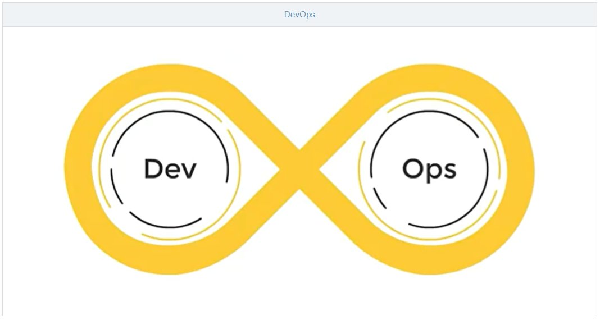

这表明[DevOps](https://blog.csdn.net/fengxiandada/article/details/124665364)是一个不断提高效率并且持续不断工作的过程

[DevOps](https://blog.csdn.net/fengxiandada/article/details/124665364)的方式可以让公司能够更快地应对更新和市场发展变化，开发可以快速交付，部署也更加稳定。

核心就在于[简化Dev和Ops团队之间的流程，使整体软件开发过程更快速。](https://blog.csdn.net/fengxiandada/article/details/124665364)

整体的软件开发流程包括：

- PLAN：开发团队根据客户的目标制定开发计划
- CODE：根据PLAN开始编码过程，需要将不同版本的代码存储在一个库中。
- BUILD：编码完成后，需要将代码构建并且运行。
- TEST：成功构建项目后，需要测试代码是否存在BUG或错误。
- DEPLOY：代码经过手动测试和自动化测试后，认定代码已经准备好部署并且交给运维团队。
- OPERATE：运维团队将代码部署到生产环境中。
- MONITOR：项目部署上线后，需要持续的监控产品。
- INTEGRATE：然后将监控阶段收到的反馈发送回PLAN阶段，整体反复的流程就是DevOps的核心，即持续集成、持续部署。

为了保证整体流程可以高效的完成，各个阶段都有比较常见的工具，如下图：
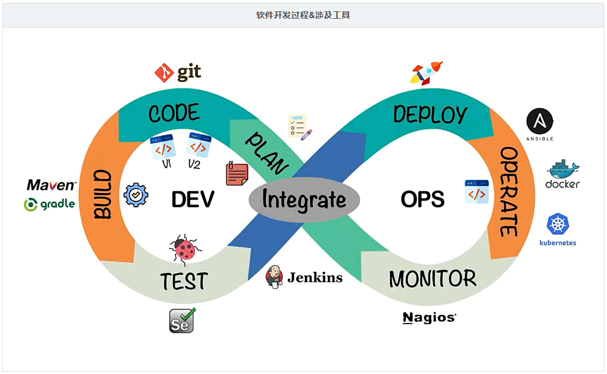

最终可以给[DevOps](https://blog.csdn.net/fengxiandada/article/details/124665364)下一个定义：[DevOps 强调的是高效组织团队之间如何通过自动化的工具协作和沟通来完成软件的生命周期管理，从而更快、更频繁地交付更稳定的软件。](https://blog.csdn.net/fengxiandada/article/details/124665364)

自动化的工具协作和沟通来完成软件的生命周期管理

## 二、Code阶段工具

在code阶段，我们需要将不同版本的代码存储到一个仓库中，常见的版本控制工具就是SVN或者Git，这里我们采用Git作为版本控制工具，GitLab作为远程仓库。

### 2.1 Git安装

https://git-scm.com/（傻瓜式安装）

### 2.2 GitLab安装

单独准备服务器，采用Docker安装

- 查看GitLab镜像

  ```shell
  docker search gitlab
  ```

- 拉取GitLab镜像

  ```shell
  docker pull gitlab/gitlab-ce
  ```

- 准备docker-compose.yml文件

  ```yaml
  version: '3.1'
  services:
    gitlab:
      image: 'gitlab/gitlab-ce:latest'
      container_name: gitlab
      restart: always
      environment:
        GITLAB_OMNIBUS_CONFIG: |
          external_url 'http://192.168.11.11:8929'
          gitlab_rails['gitlab_shell_ssh_port'] = 2224
      ports:
        - '8929:8929'
        - '2224:2224'
      volumes:
        - './config:/etc/gitlab'
        - './logs:/var/log/gitlab'
        - './data:/var/opt/gitlab'
  ```

- 启动容器（需要稍等一小会……）

  ```shell
  docker-compose up -d
  ```

- 访问GitLab首页

  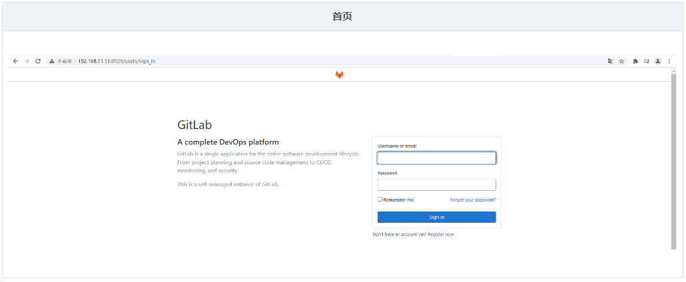

- 查看root用户初始密码

  ```shell
  docker exec -it gitlab cat /etc/gitlab/initial_root_password
  ```

  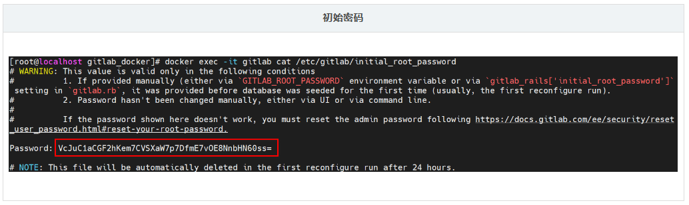

- 登录root用户

  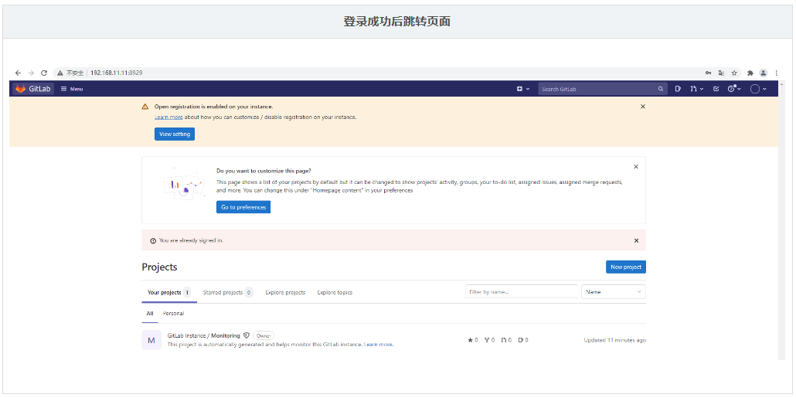

- 第一次登录后需要修改密码

  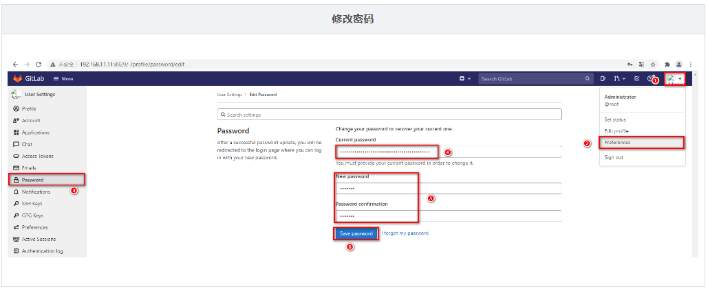

搞定后，即可像Gitee、GitHub一样使用。

## 三、Build 阶段工具

构建 Java 项目的工具一般有两种选择，一个是 Maven，一个是 Gradle。

这里我们选择 Maven 作为项目的编译工具。

具体安装 Maven 流程不做阐述，但是需要确保配置好 Maven 仓库私服以及 JDK 编译版本。

## 四、Operate 阶段工具

部署过程，会采用 Docker 进行部署，暂时只安装 Docker 即可，后续还需安装 Kubernetes。

### 4.1 Docker安装

- 准备测试环境&生产环境

- 下载Docker依赖组件

  ```shell
  yum -y install yum-utils device-mapper-persistent-data lvm2
  ```

- 设置下载Docker的镜像源为阿里云

  ```shell
  yum-config-manager --add-repo http://mirrors.aliyun.com/docker-ce/linux/centos/docker-ce.repo
  ```

- 安装Docker服务

  ```shell
  yum -y install docker-ce
  ```

- 安装成功后，启动Docker并设置开机自启

  ```shell
  # 启动Docker服务
  systemctl start docker
  # 设置开机自动启动
  systemctl enable docker
  ```

- 测试安装成功

  ```shell
  docker version
  ```

  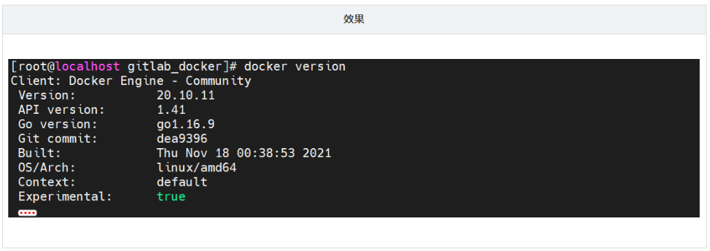

### 4.2 Docker-Compose安装

- 下载Docker/Compose：https://github.com/docker/compose

- 将下载好的docker-compose-Linux-x86_64文件移动到Linux操作系统：……

- 设置docker-compose-Linux-x86_64文件权限，并移动到$PATH目录中

  ```shell
  # 设置文件权限
  chmod a+x docker-compose-Linux-x86_64
  # 移动到/usr/bin目录下，并重命名为docker-compose
  mv docker-compose-Linux-x86_64 /usr/bin/docker-compose
  ```

- 测试安装成功

  ```shell
  docker-compose version
  ```

  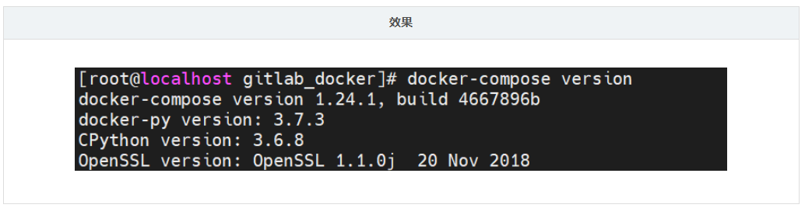

## 五、Integrate工具

持续集成、持续部署的工具很多，其中Jenkins是一个开源的持续集成平台。

Jenkins涉及到将编写完毕的代码发布到测试环境和生产环境的任务，并且还涉及到了构建项目等任务。

Jenkins需要大量的插件保证工作，安装成本较高，下面会基于Docker搭建Jenkins。

### 5.1 Jenkins介绍

Jenkins是一个开源软件项目，是基于Java开发的一种持续集成工具

Jenkins应用广泛，大多数互联网公司都采用Jenkins配合GitLab、Docker、K8s作为实现DevOps的核心工具。

Jenkins最强大的就在于插件，Jenkins官方提供了大量的插件库，来自动化CI/CD过程中的各种琐碎功能。
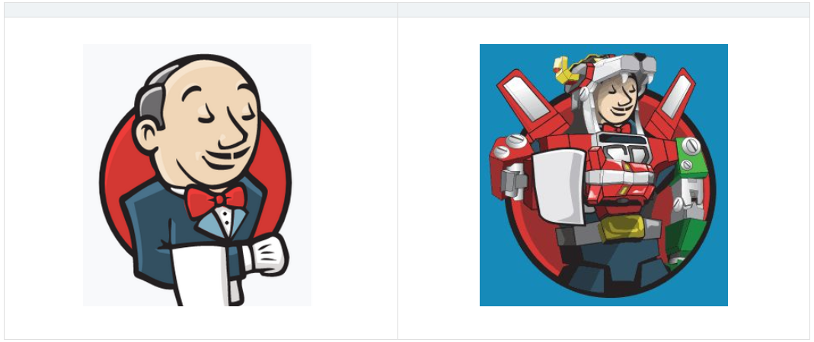

Jenkins最主要的工作就是将GitLab上可以构建的工程代码拉取 并且进行构建，再根据流程可以选择发布到测试环境或是生产环境。

一般是GitLab上的代码经过大量的测试后，确定发行版本，再发布到生产环境。

CI/CD可以理解为：

- CI过程即是通过Jenkins将代码拉取、构建、制作镜像交给测试人员测试。
  - 持续集成：让软件代码可以持续的集成到主干上，并自动构建和测试。
- CD过程即是通过Jenkins将打好标签的发行版本代码拉取、构建、制作镜像交给运维人员部署。
  - 持续交付：让经过持续集成的代码可以进行手动部署。
  - 持续部署：让可以持续交付的代码随时随地的自动化部署。

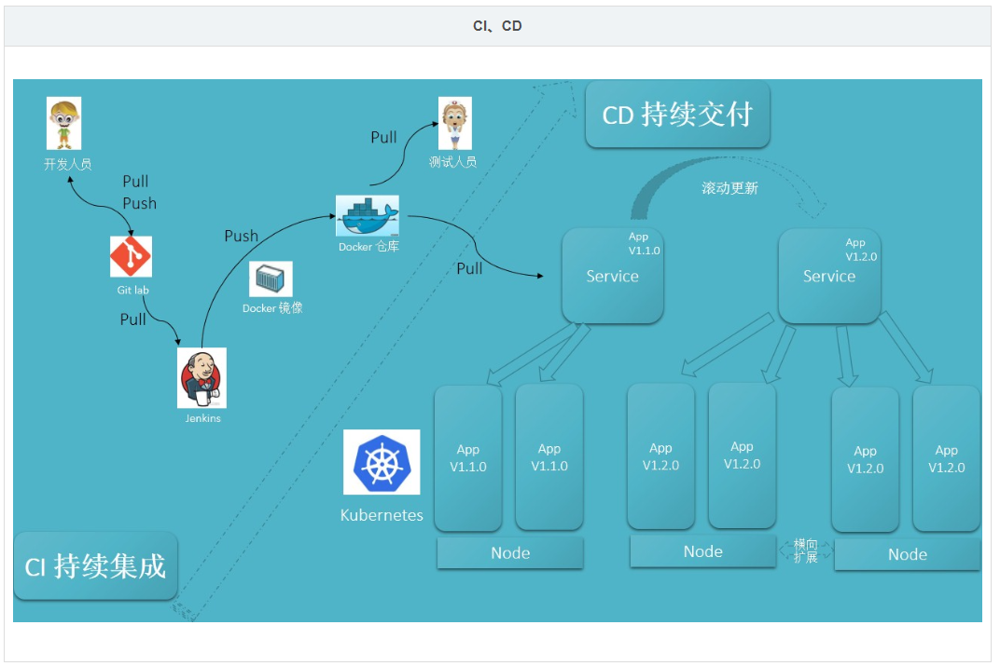

### 5.2 Jenkins安装

- 拉取Jenkins镜像

  ```shell
  docker pull jenkins/jenkins
  ```

- 编写docker-compose.yml

  ```yaml
  version: "3.1"
  services:
    jenkins:
      image: jenkins/jenkins
      container_name: jenkins
      ports:
        - 8080:8080
        - 50000:50000
      volumes:
        - ./data/:/var/jenkins_home/
  ```

- 首次启动会因为数据卷data目录没有权限导致启动失败，设置data目录写权限

  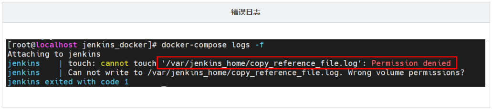

  ```shell
  chmod -R a+w data/
  ```

- 重新启动Jenkins容器后，由于Jenkins需要下载大量内容，但是由于默认下载地址下载速度较慢，需要重新设置下载地址为国内镜像站

  ```xml
  # 修改数据卷中的hudson.model.UpdateCenter.xml文件
  <?xml version='1.1' encoding='UTF-8'?>
  <sites>
    <site>
      <id>default</id>
      <url>https://updates.jenkins.io/update-center.json</url>
    </site>
  </sites>
  # 将下载地址替换为http://mirror.esuni.jp/jenkins/updates/update-center.json
  <?xml version='1.1' encoding='UTF-8'?>
  <sites>
    <site>
      <id>default</id>
      <url>http://mirror.esuni.jp/jenkins/updates/update-center.json</url>
    </site>
  </sites>
  # 清华大学的插件源也可以https://mirrors.tuna.tsinghua.edu.cn/jenkins/updates/update-center.json
  
  ```

- 再次重启Jenkins容器，访问Jenkins（需要稍微等会）

  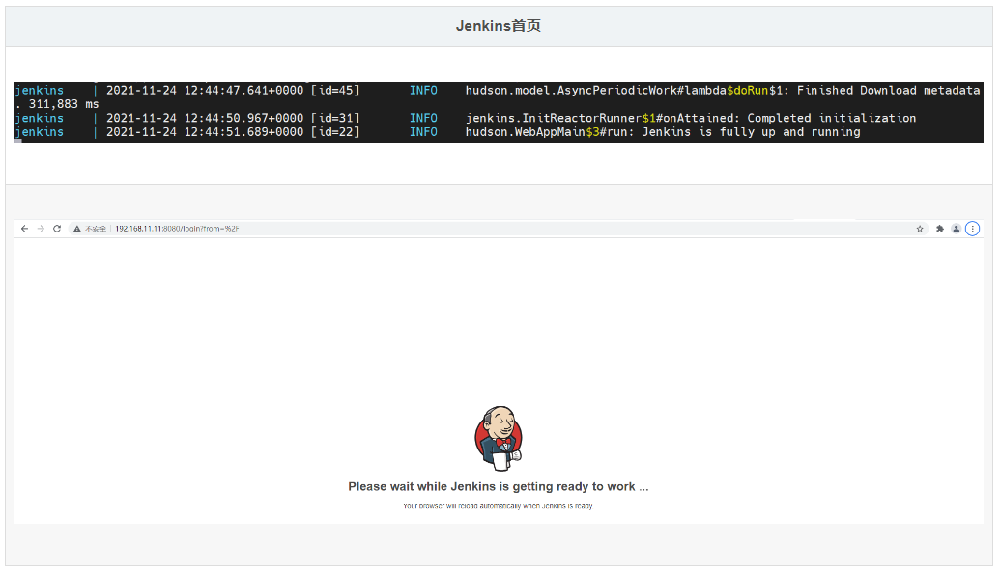

- 查看密码登录Jenkins，并登录下载插件

  ```shell
  docker exec -it jenkins cat /var/jenkins_home/secrets/initialAdminPassword
  ```

  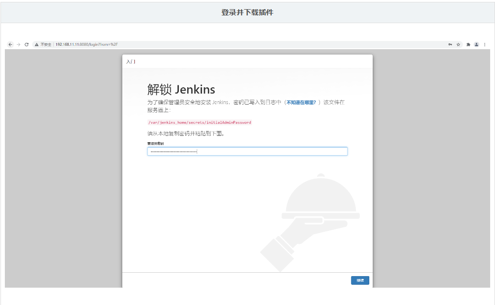

- 选择需要安装的插件

  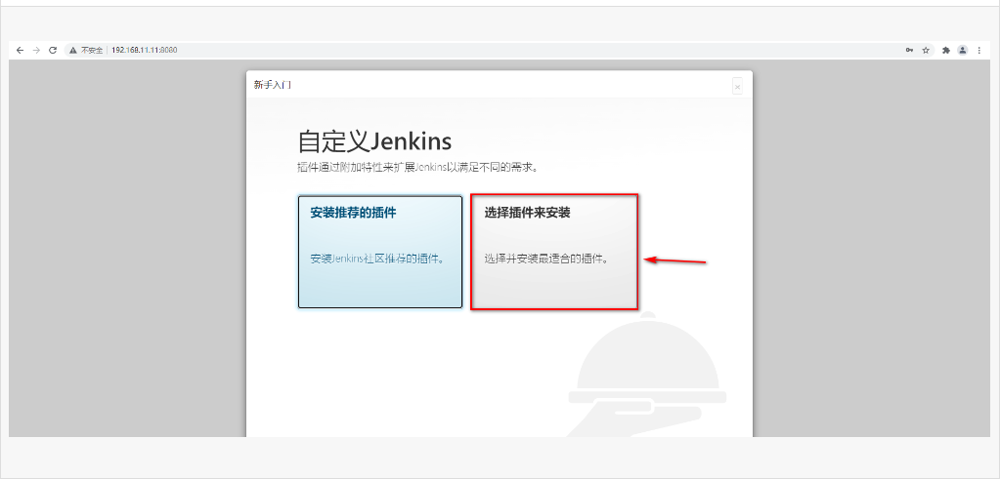

<div style="border:1px solid #eee; padding:8px; background:#fff; border-radius:4px;">

</div>