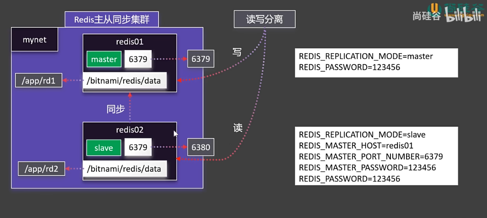
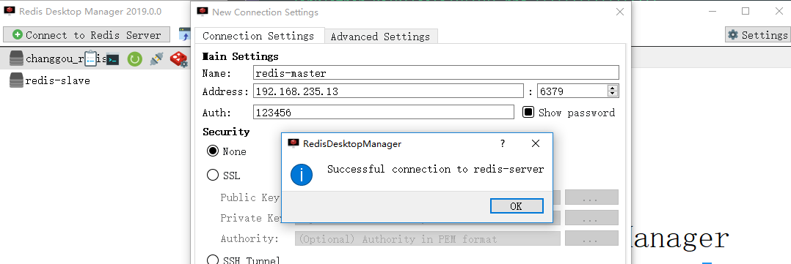
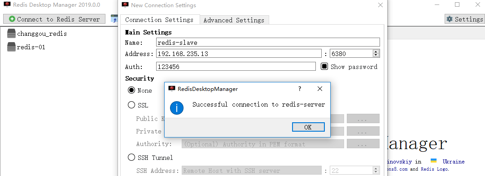
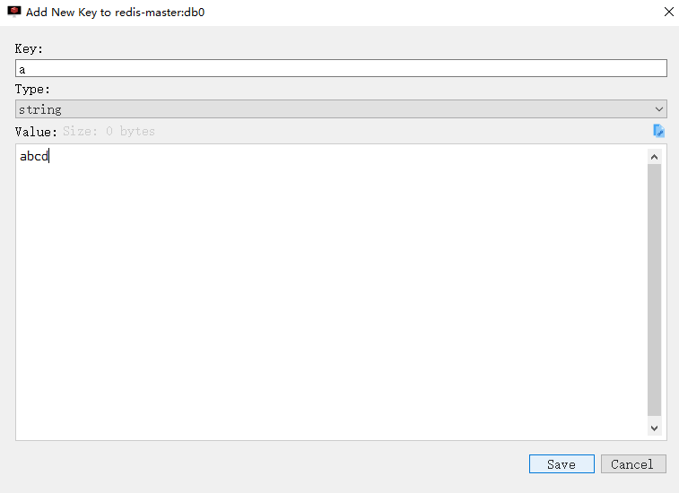
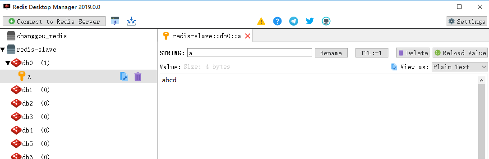

# redis 主从同步

基于docker搭建一个Redis主从同步集群， 架构图如下



```shell
# 创建挂载目录并修改权限
[root@node03 app]# mkdir /app/rd1
[root@node03 app]# mkdir /app/rd2
[root@node03 app]# chmod -R 777 /app/rd1
[root@node03 app]# chmod -R 777 /app/rd2

# 配置主redis
[root@node03 ~]# docker run -d -p 6379:6379 \
> -v /app/rd1:/bitnami/redis/data \
> -e REDIS_REPLICATION_MODE=master \
> -e REDIS_PASSWORD=123456 \
> --network mynet --name redis01 \
> bitnami/redis 

# 配置从redis
[root@node03 ~]# docker run -d -p 6380:6379 \
> -v /app/rd2:/bitnami/redis/data \
> -e REDIS_REPLICATION_MODE=slave \
> -e REDIS_MASTER_HOST=redis01 \
> -e REDIS_MASTER_PORT_NUMBER=6379 \
> -e REDIS_MASTER_PASSWORD=123456 \
> -e REDIS_PASSWORD=123456 \
> --network mynet --name redis02 \
> bitnami/redis 
```

启动redis客户端进行读写分离测试





主redis新增一条记录



从redis会自动同步

